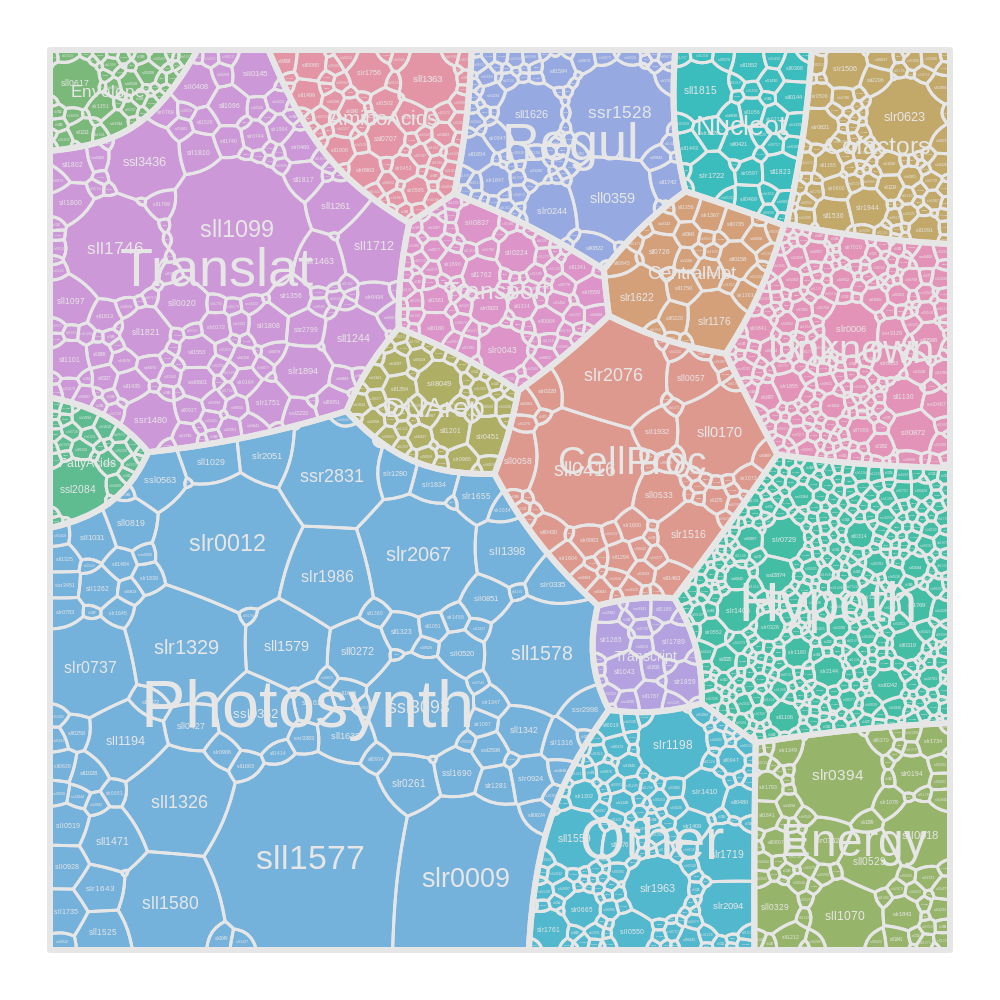
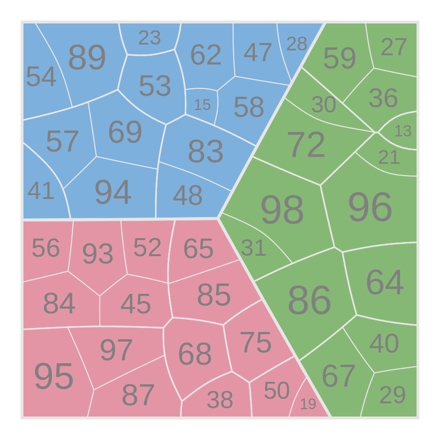
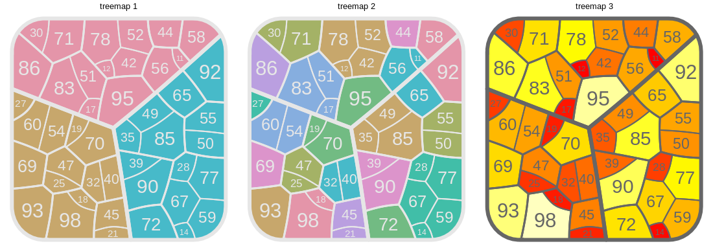
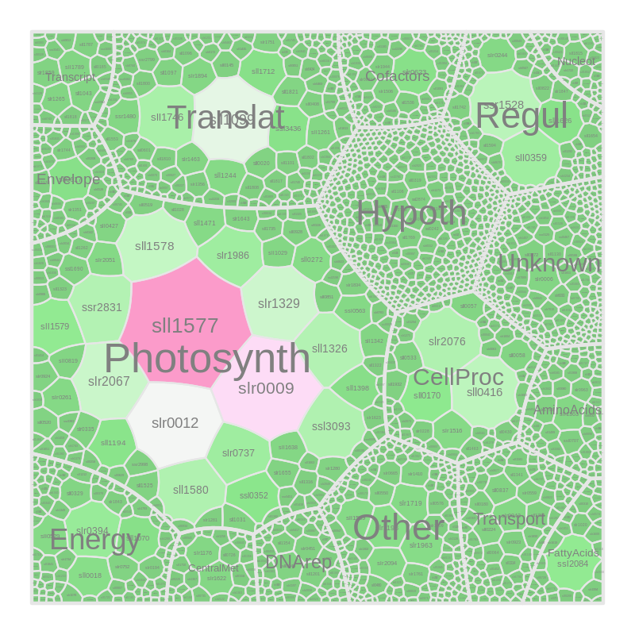

## Description

This package can be used to generate and plot **Voronoi treemaps** or
**Sunburst treemaps** from hierarchical data. 



A Voronoi treemap is a visually appealing graphical representation of data using a space-filling approach. The cells in the map are scaled according to an underlying metric which allows to grasp the hierarchical organization and relative importance of many objects at once.
There are different implementations available for Voronoi tesselations in R, the simplest being the deldir() function (from package deldir). However, deldir and others do not handle nested Voronoi tesselations, nor do they perform additively weighted Voronoi tesselation. This is an important demand for systems biology and other applications where we like to scale the cell size (or area) to a set of predefined weights. The functions provided in this package allow both the additively weighted Voronoi tesselation, and the nesting of different hierarchical levels in one plot. 

The underlying functions for the tesselation were developed and published by Paul Murrell, University of Auckland, and serve as the basis for this package. They are called by a recursive wrapper function, voronoiTreemap(), which subdivides the plot area in polygonal cells according to the highest hierarchical level.  It then continues with the tesselation on the next lower level uisng the child cell of the previous level as the new parental plotting cell, and so on. 

The sunburst treemap is a computationally less demanding treemap that does not require iterative refinement, but simply generates circle sectors that are sized according to predefined weights. It is also a arecursive algorithm and can be used to draw sectors of different hierarchical level with increasing granularity (documentation fot his function is still missing).

## Requirements

The C++ code requires the [CGAL](https://www.cgal.org/download.html) library.
For installation in (Ubuntu-like) Linux systems, type in the shell:

```
sudo apt install libcgal-dev
```

## Installation

To install the package directly from github, use this function from devtools package in your R session:

```
require(devtools)
devtools::install_github("https://github.com/m-jahn/SysbioTreemaps")
```
The package is not available on CRAN yet. 

## Usage

Create a simple example data frame

```
library(SysbioTreemaps)

df <- data.frame(
  A = rep(c("a", "b", "c"), each=15),
  B = sample(letters[4:12], 45, replace = TRUE),
  C = sample(10:100, 45)
)
```

Generate the treemap. It will return a list of polygons and metadata.
The columns of the data frame that are used as levels of the treemap need to be specified.
Different parameters like the initial shape, or the maximum number of iterations are optional.

```
tm <- voronoiTreemap(
  data = df,
  levels = c("A", "B", "C"),
  cell_size = "C",
  shape = "rounded_rect"
)
```

Draw the treempap.

```
drawTreemap(tm)
```



The voronoiTreemap() and drawTreemap() functions are separated in order to allow drawing of the same treemap object in different ways. Computation of treemaps with thousands of cells can be very time and resource consuming (minutes to hours on desktop computers). With the drawTreemap() function, we can not only plot the same treemap in different ways but also combine several treemap on one page using the 'layout' and 'position' arguments.

```
drawTreemap(tm, 
  cell_color = 1, title = "treemap 1", 
  layout = c(1,3), position = c(1, 1))

drawTreemap(tm, title = "treemap 2", 
  cell_color = 2, border_size = 6, 
  add = TRUE, layout = c(1,3), position = c(1, 2))

drawTreemap(tm, title = "treemap 3",
  cell_color = 3, border_color = grey(0.4), 
  label_color = grey(0.4),
  color_palette = heat.colors(10),
  add = TRUE, layout = c(1,3), position = c(1, 3))
```



## Adcanced example

Read test data set from Jahn et al., Cell Reports, 2018.
(https://www.cell.com/cell-reports/fulltext/S2211-1247(18)31485-2)
This dataset contains thousands of protein measurements.

```
library(dplyr)
library(colorspace)

df <- Jahn_CellReports_2018 %>%
  filter(condition == "CO2-0-15") %>%
  filter(mean_mass_fraction_norm > 0)
```

Generate treemap using some more of the function's parameters. We can increase maxIterations and decrease error tolerance which will lead to lower errors. We can set a seed to obtain a similar arrangment of cells for similar maps, otherwise it will be random. 

```
tm <- voronoiTreemap(
  data = df,
  levels = c("Process.abbr", "Pathway.abbr", "protein"),
  cell_size = "mean_mass_fraction_norm",
  shape = "rectangle",
  error_tol = 0.001,
  maxIteration = 200,
  seed = 13
)
```

We can generate a custom color palette using the colorspace wizard.

```
hclwizard()
custom.pal <- sequential_hcl(n = 40, 
  h = c(-100, 100), 
  c = c(60, NA, 66), 
  l = c(42, 100), 
  power = c(2.65, 0.7), 
  rev = TRUE)
```

Draw the treemap using some custom graphical parameters.

```
drawTreemap(
  tm, 
  color_palette = custom.pal,
  cell_color = "cell_size",
  labels = c(2,3),
  label_color = grey(0.5),
  border_color = grey(0.7)
)
```



## References and other treemap packages


The Voronoi tesselation is based on functions from Paul Murrell, https://www.stat.auckland.ac.nz/~paul/Reports/VoronoiTreemap/voronoiTreeMap.html.
We created a recursive wrapper around the main tesselation function and
improved the stability regarding generation of larger treemaps.

For a similar but JAVA based implementation of Voronoi treemaps wrapped in R, see
David Leslie's scripts at https://github.com/dlesl/voronoi_treemap_rJava.

A Javascript based R package lets you draw simple treemaps in your browser, however,
this is not suitable for treemaps with many (as, hundreds of) cells. The package is
available from CRAN or github, https://github.com/uRosConf/voronoiTreemap.

Another popular resource is the web-based treemap generation from University of
Greifswald at https://bionic-vis.biologie.uni-greifswald.de/.
